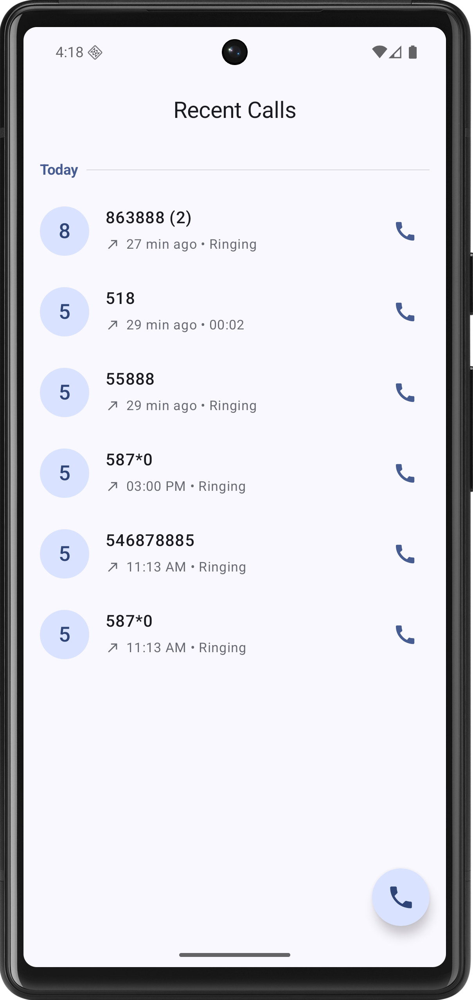
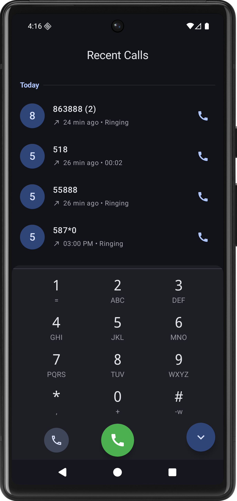
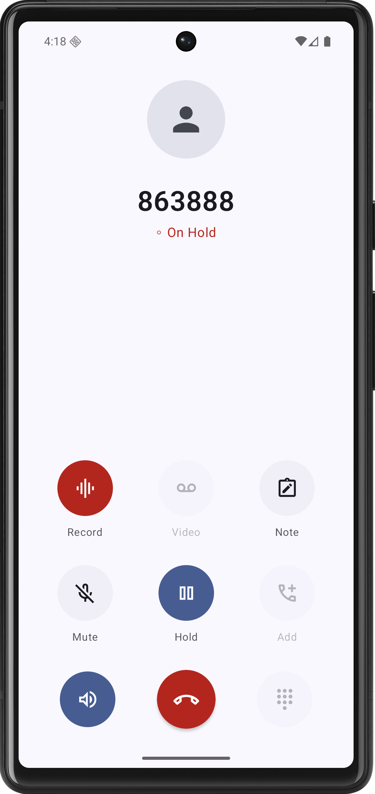
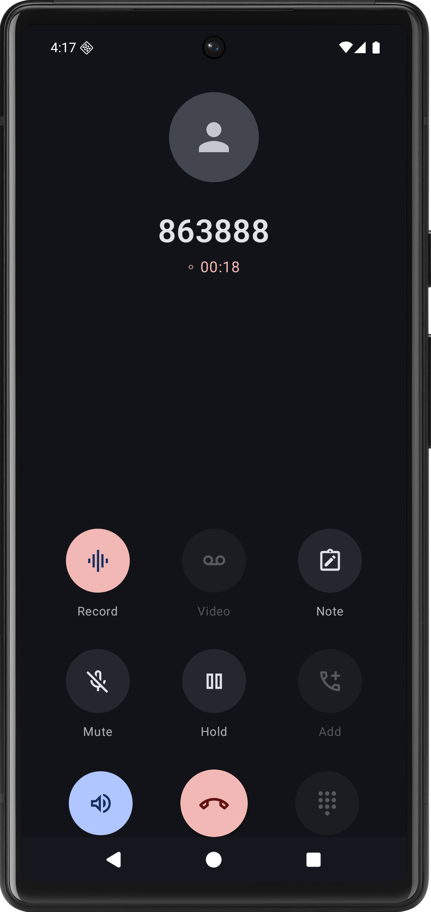

# 👻 Ghost Caller

> A **modern, premium Android dialer** built with **Jetpack Compose**, featuring **glassmorphism UI**, **real-time telephony sync**, and **intelligent call management**.

Ghost Caller reimagines the calling experience with a **frosted-glass aesthetic**, **wallpaper-aware UI**, and **deep system integration** — delivering a smooth, responsive, and elegant communication interface.

---

# 🌟 Features

## 🖼️ Glassmorphism & Adaptive UI

- **Wallpaper Integration**  
  Dynamically uses the device wallpaper as a blurred background for call screens.

- **Frosted Glass Effects (Android 12+)**  
  Real-time blur using `RenderEffect` for a premium system-like feel.

- **Responsive Layouts**  
  Seamlessly adapts across:
    - 📱 Portrait
    - 🔄 Landscape
    - 💻 Tablet / Widescreen (≥600dp)

---

## 📞 Intelligent Call Management

- **Smart Call Logs**  
  Automatically groups consecutive calls from the same contact to reduce clutter.

- **Advanced Caller Identification**  
  Offline location detection (City / State / Country) using **Google libphonenumber**.

- **Gesture-Based Actions**
    - 👉 Swipe Right → Call
    - 👈 Swipe Left → Delete
    - 📳 Haptic feedback included

- **Real & Simulated Calling Modes**
    - 📡 Real GSM calls
    - 🎭 Simulated calls (for testing / privacy)

---

## 🧠 Real-Time Telephony Engine

- **Live Call State Tracking**  
  Instantly reacts to:
    - Dialing
    - Incoming
    - Active
    - Call End

- **Automatic Log Sync**  
  Refreshes call logs immediately after call termination using background coroutines.

---

## 🛠️ Technical Stack

| Category        | Technology |
|----------------|----------|
| Language        | Kotlin |
| UI Framework    | Jetpack Compose (Material 3) |
| Architecture    | MVVM |
| State / Async   | Coroutines, StateFlow, ViewModel |
| Telephony       | TelephonyManager, CallLog |
| Libraries       | libphonenumber (Google), Geocoder |
| Animations      | Compose Animations |
| Build System    | Gradle (Kotlin DSL) |

---

## 📸 Preview

<div align="center">

### 🏠 Home Screen



<br/><br/>

### 📞 Call Screen



</div>

---

## 🏗️ Architecture Overview

### 📡 Communication Engine

The app uses `TelephonyManager` to listen for system-level call state changes.

Flow:
1. Call initiated via `Intent.ACTION_CALL`
2. Track states:
    - `OFFHOOK`
    - `IDLE`
3. On call end:
    - Wait for system DB update
    - Refresh call logs via `StateFlow`

---

### 📱 Responsive UI System

- Uses `LocalConfiguration` to detect screen size
- Switches layouts dynamically:
    - 📱 Vertical layout (phones)
    - 💻 Multi-pane layout (tablets)
- Dialpad becomes a fixed sidebar in widescreen mode

---

## 📥 Installation

### Prerequisites

- Android Studio Ladybug+
- Android SDK 30+
- Physical device recommended (for telephony features)

---

### Setup

```bash
git clone https://github.com/dontknow492/Ghost-Caller.git